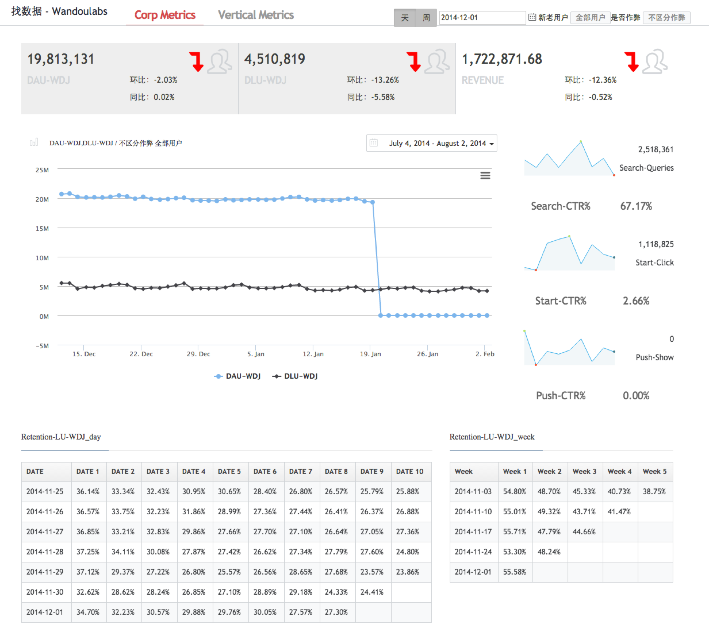
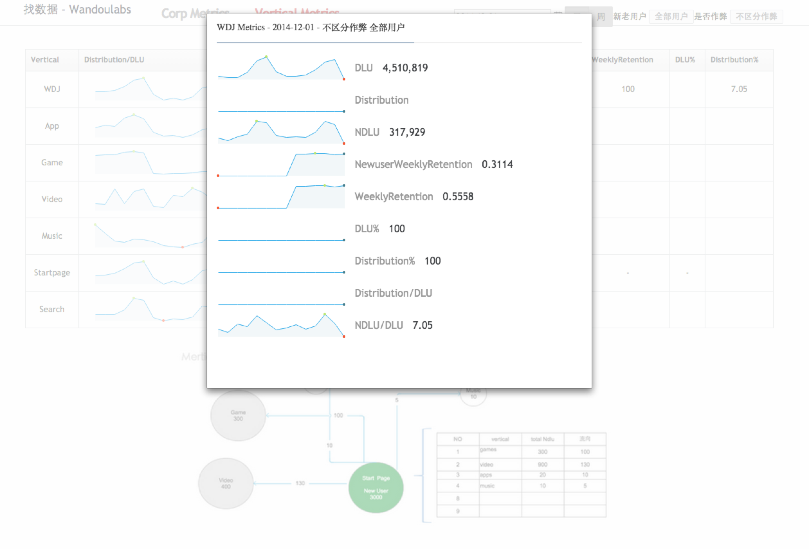

## Development

- 1 npm install -g gulp
- 2 npm install # cd to project directory exec to install build dependencies
- 3 npm watch # check sass to generate css
- 4 npm build # generate dist folder for deploy

### Screenshots

